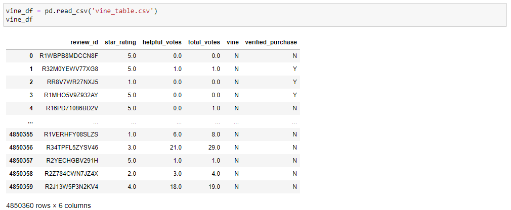
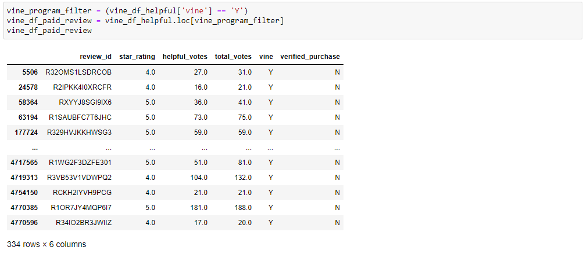
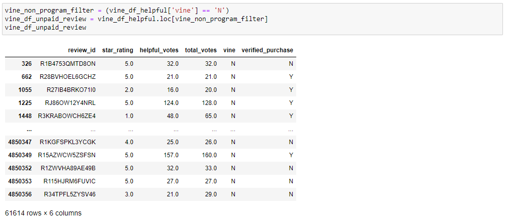
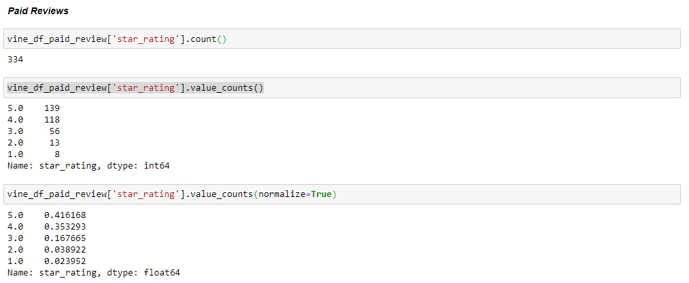
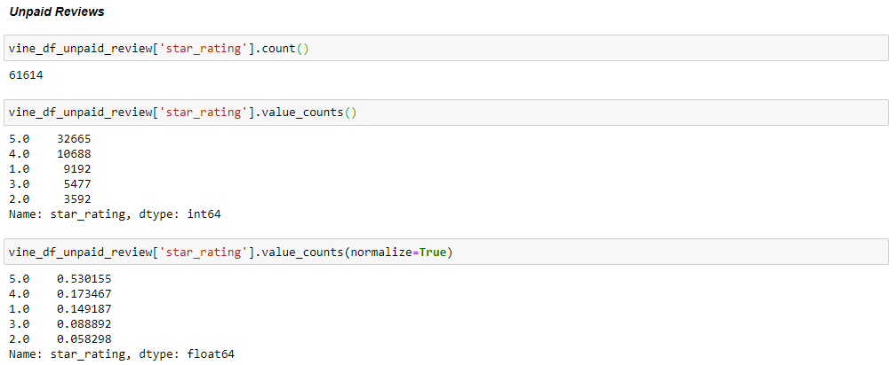
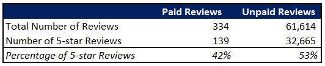

# DABC-Amazon_Vine_Analysis

## Overview

The purpose of the analysis is to gain insights into the Amazon Vine Review Program to determine if there is any positive bias toward favorable reviews from Vine memebers. Review dataset is available online and the Sports product review dataset is picked for this analysis. The data was extracted, transformed and loaded using Google Colab Notebooks and loaded onto a SQL database (PostgresSQL) that is connected to an AWS RDS instance. Finally, the analysis is performed on Jupyter Notebook by reading in the extracted csv file for the Vine Table from PostgresSQL.

## Source

General Amazon Review Dataset:

https://s3.amazonaws.com/amazon-reviews-pds/tsv/index.txt

Dataset selected for this analysis:

https://s3.amazonaws.com/amazon-reviews-pds/tsv/amazon_reviews_us_Sports_v1_00.tsv.gz

## Results

A database was created in PostgresSQL to house the Vine review data in multiple relational tables. One of the tables created was the Vine Table, which was exported as csv file and loaded onto Jupyter Notebook for our analysis, as shown in below screenshot.

</img>

A number of filters were performed on this DataFrame:

1. Filtered for rows where Total Votes are greater than or equal to 20

2. Further filtered for all rows where the number of helpful_votes divided by total_votes is equal to or greater than 50%. This dataframe is named as "vine_df_helpful"

3. Using the table created in Step 2, a dataframe is created to retreive all paid reviews, as shown below:

</img>

4. Using the table created in Step 2, a dataframe is created to retreive all unpaid reviews, as shown below:

</img>

Based on the dataframes created in Steps 3 and 4, calculations were made to determine the

 1. Number of Vine (paid) and non-Vine (unpaid) reviews

 2. The number of 5-star reviews for each category

 3. The percetnage of 5-star reviews for each category

 </img>

 </img>

End results are summarized in the table below. 

</img>

Based on percentages of 5-star reviews, having a paid Vine review does not appear to make a positive difference in the percentage of 5-star reviews. In fact, the percentage of 5-star ratings from paid reviews is 11% lower than unpaid reviews. However, although a 5-star rating is the highest possible rating for any given review, it is not the only rating in the range of positive reviews. To further verify this statement, we should group the ratings into 3 groups: negative (ratings from 1 to 2 stars), neutral (rating of 3 stars), and positive (rating of 4 to 5 stars). A percentage of ratings for each group should be calculated for both the paid and unpaid category, across multiple randomly selected datasets instead performing the analysis on only one dataset. Lastly, we should run a t-test to determine if the average percentage of postive ratings from paid reviews is statistically greater than the average percentage of postive ratings from unpaid reviews.

